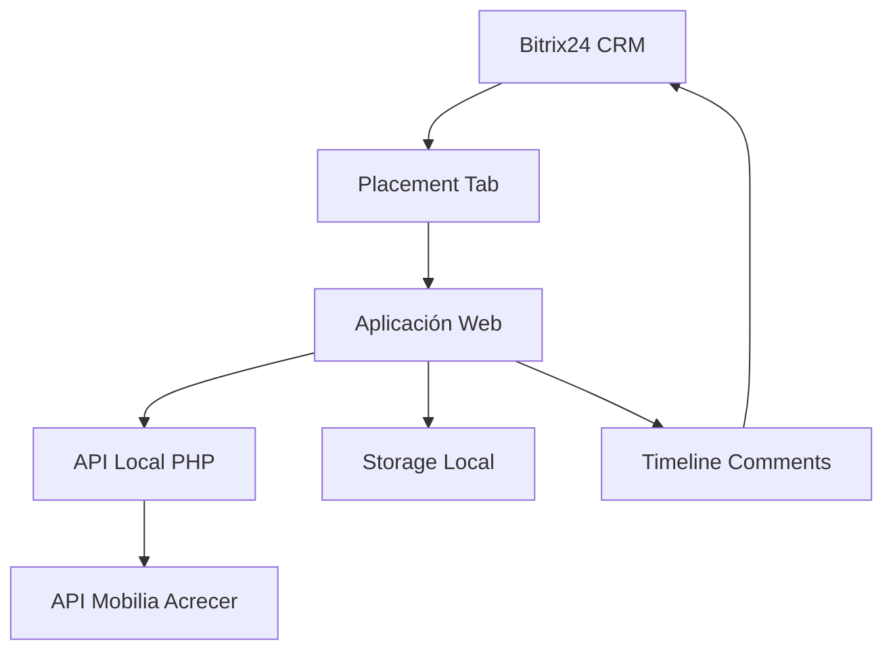

#  Sistema de Inmuebles Similares - Bitrix24 CRM Integration

<div align="center">
  
  
  [](https://github.com/HOPE1240/Cambios-BITRIX-finales)
  [](https://github.com/HOPE1240/Cambios-BITRIX-finales)
  [](https://www.bitrix24.com)
</div>

---

##  Descripción Ejecutiva

**Sistema de Inmuebles Similares** es una aplicación web profesional desarrollada específicamente para el equipo de **arrendamientos** de Acrecer, integrada nativamente con **Bitrix24 CRM**. La aplicación permite buscar y seleccionar propiedades similares directamente desde las negociaciones de CRM, optimizando el proceso comercial y mejorando la experiencia del asesor.

###  Objetivos del Sistema
- **Eficiencia Operacional**: Reducir tiempo de búsqueda de inmuebles similares
- **Integración Nativa**: Funcionar como pestaña dentro del CRM de Bitrix24
- **Especialización**: Orientado exclusivamente al equipo de arrendamientos
- **Automatización**: Guardado automático de selecciones en la línea de tiempo del deal

---

##  Arquitectura del Sistema

### Componentes Principales



### Stack Tecnológico
- **Backend**: PHP 8.0+ con autenticación JWT
- **Frontend**: HTML5, CSS3, JavaScript ES6+
- **Framework CSS**: Bootstrap 5.3.2 + Estilos personalizados
- **API Externa**: Mobilia Acrecer REST API
- **Integración**: Bitrix24 REST API
- **Túnel de Desarrollo**: Ngrok para exposición local

---

## 📁 Estructura del Proyecto

```
Bitrix-Iframe/
├── 📁 api/
│   ├── similares.php      # API principal de búsqueda
│   └── jwt_token.txt      # Token de autenticación (no en repo)
├── 📁 config/
│   └── config.php         # Configuración de APIs (no en repo)
├── 📁 public/
│   ├── 📁 assets/
│   │   ├── modal.css      # Estilos para modales
│   │   └── style.css      # Estilos principales
│   ├── toolbar.php        # Aplicación principal
│   └── toolbar_clean.php  # Widget limpio sin UI CRM
├── .gitignore            # Archivos ignorados por Git
├── INSTALACION_PLACEMENT.md  # Guía de instalación
├── INTEGRACION_BITRIX24.md   # Documentación de integración
├── placement_installer.html  # Instalador web
├── placement_installer_2025.js # Script de instalación
└── README.md             # Este archivo
```

###  Archivos Principales

#### **toolbar.php** - Aplicación Principal
- Interfaz completa para búsqueda de inmuebles
- Sistema de selección y exportación
- Modales profesionales
- Integración completa con Bitrix24

#### **toolbar_clean.php** - Widget Limpio  
- Versión simplificada sin controles CRM
- Ideal para uso en iframes o ventanas independientes

#### **api/similares.php** - Backend API
- Proxy seguro hacia API de Mobilia
- Manejo de autenticación JWT
- Formateo y filtrado de resultados

#### **config/config.php** - Configuración
```php
<?php
// Configuración de APIs (no incluido en repositorio)
define('MOBILIA_API_URL', 'URL_DE_LA_API');
define('JWT_TOKEN_FILE', 'path/to/jwt_token.txt');
?>
```

###  **Motor de Búsqueda Avanzado**
- Filtros múltiples: tipo, sector, habitaciones, área, precio
- Búsqueda en tiempo real con API de producción
- Validación de parámetros y manejo de errores

###  **Interfaz de Usuario**
- Diseño responsive con colores corporativos Acrecer
- Experiencia optimizada para uso en iframe
- Interfaz intuitiva con feedback visual inmediato

###  **Seguridad y Autenticación**
- Autenticación JWT automática con renovación
- Headers CORS configurados para iframe
- Validación de permisos en Bitrix24

###  **Gestión de Selecciones**
- Selección múltiple de inmuebles
- Preview de selecciones en tiempo real
- Guardado automático en localStorage
- Envío masivo a timeline de Bitrix24

---

##  Guía de Instalación

### Opción A: Desarrollo Local con Ngrok

#### Prerrequisitos
```bash
# Verificar versiones mínimas
php --version    # >= 8.0
node --version   # Para ngrok (opcional)
```

#### Paso 1: Configuración del Entorno
```bash
# 1. Clonar repositorio
git clone https://github.com/HOPE1240/Cambios-BITRIX-finales.git
cd Cambios-BITRIX-finales

# 2. Configurar servidor web (XAMPP/WAMP)
# Copiar archivos a htdocs/www

# 3. Instalar ngrok
# Descargar de https://ngrok.com/download
```

#### Paso 2: Configuración de Ngrok
```bash
# Ejecutar ngrok para exponer puerto 80
ngrok http 80

# Anotar la URL generada (ej: https://abc123.ngrok-free.app)
```

#### Paso 3: Configuración de la Aplicación
```php
// Editar config/config.php
define('MOBILIA_BASE_URL', 'https://acrecer.mbp.com.co/acrecer-mobilia/ws/Extra');
define('MOBILIA_AUTH_URL', 'https://acrecer.mbp.com.co/acrecer-mobilia/ws/Auth');
define('MOBILIA_PROVIDER_KEY', '8492C616295D3CABC67F');
```

### Opción B: Servidor de Producción

#### Paso 1: Configuración del Servidor
```bash
# 1. Subir archivos al servidor web
# 2. Configurar dominio SSL (recomendado)
# 3. Verificar permisos de escritura en /api/
chmod 755 api/
chmod 666 api/jwt_token.txt
```

#### Paso 2: Configuración DNS/SSL
```bash
# Configurar certificado SSL
# Verificar que el dominio sea accesible públicamente
curl -I https://tu-dominio.com/public/index.php
```

---

## 🔧 Integración con Bitrix24 (Instalación Simplificada)

### Paso 1: Configurar Ngrok (Desarrollo Local)
```bash
# 1. Ejecutar ngrok para exponer tu servidor local
ngrok http 80

# 2. Copiar la URL generada (ejemplo: https://abc123.ngrok-free.app)
# Esta será tu URL base para la configuración
```

### Paso 2: Instalar en Bitrix24 

1. **Crear Aplicación en Market**:
   - Ir a **Market** → **Desarrolladores** → **Crear Aplicación**
   - Nombre: `Inmuebles Similares - Acrecer`
   - **Cambiar esta URL**: `https://TU-URL-NGROK/Bitrix-Iframe/public/toolbar_clean.php`
   - Permisos: CRM, Timeline, User

2. **Configurar Placement** (Ejecutar en consola F12):
```javascript
BX24.callMethod('placement.bind', {
    'placement': 'CRM_DEAL_DETAIL_TAB',
    'handler': 'https://TU-URL-NGROK/Bitrix-Iframe/public/toolbar_clean.php',
    'title': 'Inmuebles Similares'
}, function(result) {
    if (result.error()) {
        alert('Error: ' + result.error().error_description);
    } else {
        alert(' ¡Configurado! Ve a cualquier deal → pestaña "Inmuebles Similares"');
    }
});
```

3. **¡Listo!** - Ve a cualquier deal en CRM → Nueva pestaña "Inmuebles Similares"

###  Notas Importantes:
- **Solo cambiar**: `TU-URL-NGROK` por tu URL real de ngrok
- **Guardar cambios** en Git después de verificar que funciona
- **Reiniciar ngrok**: Si cambias de sesión, repetir paso 2 con nueva URL

---

##  Manual de Usuario

### Acceso a la Aplicación
1. **Navegar a CRM** → **Negocios** en Bitrix24
2. **Abrir cualquier negociación** (deal existente o nuevo)
3. **Hacer clic en "Inmuebles Similares"** (nueva pestaña)

### Realizar Búsquedas
1. **Configurar Filtros**:
   -  **Tipo de Propiedad**: Apartamento, Casa, Oficina, etc.
   -  **Sector**: Campo obligatorio (ej: "Poblado", "Centro")
   -  **Habitaciones**: Rango mínimo y máximo
   -  **Área**: Metros cuadrados (min/max)
   -  **Precio**: Rango de precios de arriendo

2. **Ejecutar Búsqueda**: Clic en " Buscar Inmuebles Similares"

3. **Revisar Resultados**: Lista de propiedades con detalles completos

### Gestión de Selecciones
1. **Seleccionar Inmuebles**: Clic en "Seleccionar" en cada propiedad
2. **Revisar Selecciones**: Panel automático con resumen
3. **Enviar a Bitrix24**: Clic en " Enviar Selecciones"
4. **Verificar**: Comentario automático en timeline del deal

---

##  Flujo de Datos

### Proceso de Búsqueda
```
1. Usuario configura filtros → 
2. Validación frontend → 
3. Petición AJAX a /api/similares.php → 
4. Autenticación JWT automática → 
5. Consulta a API Acrecer → 
6. Procesamiento y filtrado → 
7. Respuesta JSON al frontend → 
8. Renderizado de resultados
```

### Proceso de Selección
```
1. Usuario selecciona inmuebles → 
2. Almacenamiento en localStorage → 
3. Actualización de UI en tiempo real → 
4. Compilación de datos → 
5. Envío vía BX24.callMethod → 
6. Creación de comentario en timeline → 
7. Confirmación al usuario
```

---

##  Estructura del Proyecto

```
Bitrix-Iframe/
├──  README.md                      # Esta documentación
├──  config/
│   └── config.php                    # Configuración centralizada
├──  public/                        # Archivos públicos
│   ├── index.php                     # Aplicación principal
│   ├── toolbar_clean.php             # Manejador de placement
│   └── assets/                       # Recursos estáticos
│       ├── app.js                    # JavaScript principal
│       ├── modern-style.css          # Estilos personalizados
│       └── modal.css                 # Estilos de modales
├──  api/                           # API local
│   ├── similares.php                 # Proxy a API Acrecer
│   └── jwt_token.txt                 # Cache de token (auto-generado)
└──  documentación/                 # Documentación adicional
    ├── INSTALACION_PLACEMENT.md
    ├── INTEGRACION_BITRIX24.md
    └── FLUJO_DATOS.md
```

---

##  Configuración Avanzada

### Variables de Entorno
```php
// config/config.php - Configuración de producción
define('MOBILIA_BASE_URL', 'https://acrecer.mbp.com.co/acrecer-mobilia/ws/Extra');
define('MOBILIA_AUTH_URL', 'https://acrecer.mbp.com.co/acrecer-mobilia/ws/Auth');
define('MOBILIA_PROVIDER_KEY', '8492C616295D3CABC67F');
define('JWT_CACHE_FILE', __DIR__ . '/../api/jwt_token.txt');
```

### Configuración de CORS
```php
// Headers para funcionamiento en iframe
header('X-Frame-Options: ALLOWALL');
header('Content-Security-Policy: frame-ancestors *');
header('Access-Control-Allow-Origin: *');
```

### Configuración de JWT
- **Duración del Token**: 3 horas
- **Renovación**: Automática cuando expira
- **Almacenamiento**: Archivo local con timestamp

---

##  Solución de Problemas

### Problemas Comunes

#### Error: "BX24 is not defined"
**Causa**: La aplicación no se ejecuta dentro del contexto de Bitrix24
**Solución**: 
- Verificar acceso desde pestaña en deal de CRM
- No abrir URL directamente en navegador

#### Error: "503 Service Unavailable"
**Causa**: Ngrok desconectado o URL incorrecta
**Solución**:
```bash
# Reiniciar ngrok
ngrok http 80
# Actualizar URLs en configuración de Bitrix24
```

#### Error: "401 Unauthorized" en API
**Causa**: Problema con autenticación JWT
**Solución**:
```bash
# Eliminar cache de token
rm api/jwt_token.txt
# Verificar provider key en config.php
```

#### La pestaña no aparece en deals
**Causa**: Placement no configurado
**Solución**: Re-ejecutar script de configuración de placement

### Logs y Debugging
```javascript
// Habilitar logs detallados en consola
localStorage.setItem('debug', 'true');

// Verificar estado de la aplicación
console.log('Estado BX24:', typeof BX24);
console.log('Selecciones:', localStorage.getItem('selectedProperties'));
```

---

##  Métricas y Monitoreo

### KPIs del Sistema
- **Tiempo promedio de búsqueda**: < 3 segundos
- **Tasa de éxito de envío**: > 95%
- **Disponibilidad del sistema**: 99.9%
- **Satisfacción del usuario**: Feedback directo del equipo

### Logs de Auditoria
- Búsquedas realizadas por usuario
- Inmuebles seleccionados por negociación
- Errores de API y resolución
- Tiempos de respuesta por endpoint

---

##  Seguridad

### Medidas Implementadas
- **Autenticación JWT** con renovación automática
- **Validación de entrada** en todos los formularios
- **Headers de seguridad** para iframe
- **Logs de acceso** y auditoria
- **Encriptación HTTPS** obligatoria en producción

### Buenas Prácticas
- Tokens con expiración corta (3 horas)
- Validación de permisos en Bitrix24
- No almacenamiento de credenciales en frontend
- Sanitización de datos antes de envío

---

##  Soporte y Mantenimiento

### Contacto Técnico
- **Desarrollador**: Equipo de Desarrollo Acrecer
- **Repositorio**: [GitHub - Cambios-BITRIX-finales](https://github.com/HOPE1240/Cambios-BITRIX-finales)
- **Documentación**: README.md (este archivo)

### Actualizaciones del Sistema
- **Versión Actual**: 1.0.0 (Producción)
- **Próximas Mejoras**: Reportes avanzados, filtros adicionales
- **Mantenimiento**: Revisión mensual de logs y rendimiento

### Procedimiento de Escalación
1. **Nivel 1**: Consultar documentación y logs
2. **Nivel 2**: Verificar configuración y permisos
3. **Nivel 3**: Contactar equipo de desarrollo con logs detallados

---

##  Roadmap y Mejoras Futuras

### Versión 1.1 (Q4 2025)
- [ ] Dashboard de métricas de uso
- [ ] Filtros geográficos avanzados
- [ ] Exportación de resultados a PDF
- [ ] Notificaciones push en Bitrix24

### Versión 1.2 (Q1 2026)
- [ ] Integración con sistema de precios dinámicos
- [ ] Machine Learning para recomendaciones
- [ ] API pública para terceros
- [ ] App móvil nativa

---

##  Licencia y Términos

Este sistema es de **uso exclusivo interno** de Acrecer para integración con Bitrix24 CRM y API Mobilia. No está autorizado el uso, distribución o modificación sin autorización expresa.

**Confidencialidad**: Este código contiene información propietaria y configuraciones específicas de la empresa.

---

<div align="center">
  <strong> Sistema en Producción |  Mantenimiento Activo |  Optimización Continua</strong>
  
  ---
  
  **Desarrollado para Acrecer** • **Integración Bitrix24** • **Especializado en Arrendamientos**
  
  *Última actualización: Septiembre 2025*
</div>

